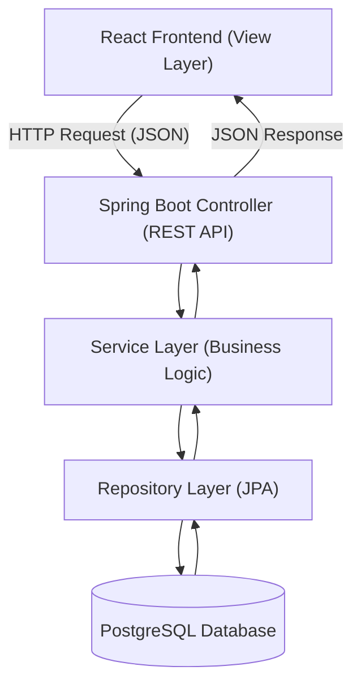

```mermaid
flowchart TD
    A["React Frontend (View Layer)"]
    B["Spring Boot Controller (REST API)"]
    C["Service Layer (Business Logic)"]
    D["Repository Layer (JPA)"]
    E[(PostgreSQL Database)]

    A -->|"HTTP Request (JSON)"| B
    B --> C
    C --> D
    D --> E
    E --> D
    D --> C
    C --> B
    B -->|"JSON Response"| A
```

SS

1. Signup
