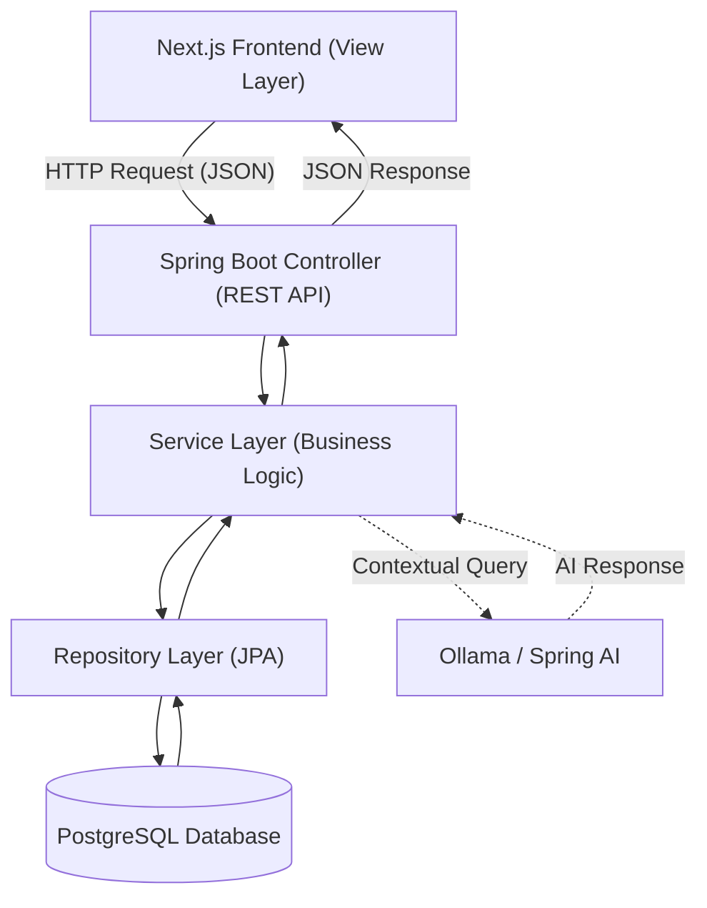

>> Project is currently running.

# Smart Digital Hostel Ecosystem 🏨

The **Smart Digital Hostel Ecosystem** is a robust, scalable management platform designed to digitize manual hostel operations. Built for modern student housing like **Shagorika Girls Hostel**, this system enhances transparency, automates financial tracking, and provides real-time administrative oversight.

---

## 🚀 Key Features

### **Student Experience**
* **Digital Complaint Desk:** Register and track maintenance issues (Electrical, Plumbing, etc.) with real-time status updates.
<!-- * **Leave Management:** Digital application for leave with instant status tracking for approvals. -->
* **Smart Mess Services:** View weekly menus and opt for flexible daily or monthly meal plans.
* **Financial Dashboard:** Real-time access to fee structures, payment history, and pending dues.

### **Administration & Warden Tools**
* **Occupancy Monitoring:** Centralized dashboard for real-time room allocation and vacancy tracking.
* **Automated Workflow:** Streamlined approval system for leave requests and complaint resolutions.
* **Fee Management:** Oversee collections and generate automated due lists for the entire hostel.
<!-- * **Instant Notifications:** Publish announcements and update mess menus instantly across the platform. -->

---

<!-- ## 🤖 Intelligent Query Assistant (AI)

We have integrated a **Private AI Assistant** using **Spring AI** and **Ollama** to provide instant institutional support while ensuring data privacy.

### **AI Tech Stack**
* **LLM Engine:** `gpt-oss` via Ollama for reasoning and answering.
* **Embedding Model:** `nomic-embed-text` for high-accuracy vector representations.
* **Architecture:** Retrieval-Augmented Generation (RAG).

### **Core Capabilities**
* **Scoped Knowledge:** The assistant is strictly bounded to internal hostel documentation, rules, and FAQs.
* **Local Data Privacy:** All processing happens locally through Ollama, ensuring sensitive student data never leaves the infrastructure.
* **Accuracy:** RAG ensures the model retrieves actual hostel policies before answering, preventing hallucinations.

--- -->

## 🏗️ System Architecture (MVC)

**The application follows a clean **MVC (Model-View-Controller)** pattern to ensure scalability and ease of maintenance.



---

## 🛠️ Tech Stack

* **Backend:** Spring Boot (Java) 
* **Frontend:** HTML5, CSS3, JavaScript (Tailwind CSS & DaisyUI via CDN)
<!-- * **AI Integration:** Spring AI & Ollama -->
* **Database:** PostgreSQL 
* **Tools:** Git, Ubuntu, VS Code (with Live Server extension)


## 📂 Getting Started

Follow these setup instructions to get a local copy of the project up and running on your machine.

### 📋 Prerequisites

Before you begin, ensure you have the following installed:
- **Git**
- **Java Development Kit (JDK 17 or higher)**
- **Apache Maven**
- **PostgreSQL Database Engine**
- **VS Code** (with the *Live Server* extension active)

---

### 🛠️ Installation & Execution Steps

#### 1. Clone the Repository & Switch Branch
Open your terminal or command prompt and execute the following commands to clone the repository and switch to the development branch:
```bash
git clone git@github.com:Water-Pot/SMART-DIGITAL-HOSTEL-ECOSYSTEM.git
cd SMART-DIGITAL-HOSTEL-ECOSYSTEM
git checkout aranna

```

#### 2. Database Configuration (PostgreSQL)

Log in to your preferred PostgreSQL client (such as pgAdmin, DBeaver, or your terminal console) and create the application database by running:

```sql
CREATE DATABASE smart_hostel_management;

```

> 📌 **Note:** If your local PostgreSQL instance uses custom credentials, remember to update the username and password details inside the backend's configuration file (`src/main/resources/application.properties`).

#### 3. Run the Backend Server (Spring Boot)

Navigate to the module directory where your backend `pom.xml` file resides, then launch the server via Maven:

```bash
mvn spring-boot:run

```

*Once successfully initialized, the backend API layer will serve endpoints on its default port (`http://localhost:8001`).*

#### 4. Launch the Frontend Application (Live Server)

1. Launch **VS Code** and open the workspace folder housing your frontend HTML/CSS/JS ecosystem assets.
2. Verify that the **Live Server** extension is enabled.
3. Open the `login.html` file within the editor window.
4. Right-click anywhere inside the file editor and choose **"Open with Live Server"**, or alternatively click the wireless **Go Live** button located along the bottom-right status bar of the VS Code window.


<!-- ---
### **Prerequisites**
* Java 17+
* Node.js & npm
* Ollama installed and running (`ollama serve`)

### **1. Setup AI Models**
```bash
ollama pull gpt-oss
ollama pull nomic-embed-text
```

### **2. Backend Configuration**
Edit `src/main/resources/application.properties`:
```properties
# Database Config
spring.datasource.url=jdbc:postgresql://localhost:5432/hostel_db
spring.datasource.username=your_username
spring.datasource.password=your_password

# Ollama Config
spring.ai.ollama.base-url=http://localhost:11434
spring.ai.ollama.chat.options.model=gpt-oss
spring.ai.ollama.embedding.options.model=nomic-embed-text
```

---

## 📸 Screenshots

### **1. User Authentication (Signup)**
Testing the backend authentication flow via Postman.
<p align="center">
  
</p>


##
Transaction
- String userName
- String roomNo
- String transactionType
- String paymentMethod
- String paymentPurpose
- BigDecimal amount -->


### SS


